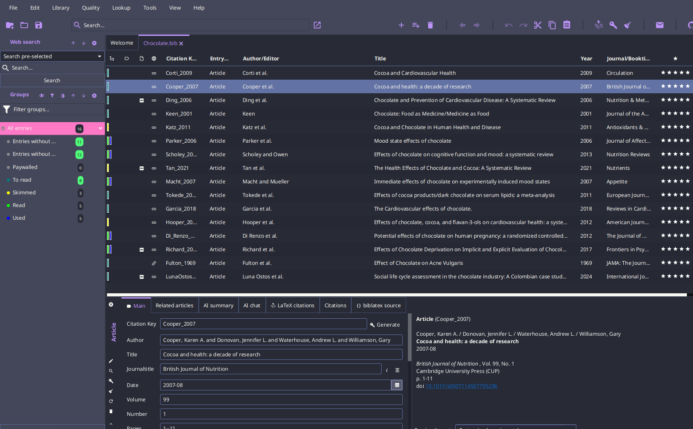
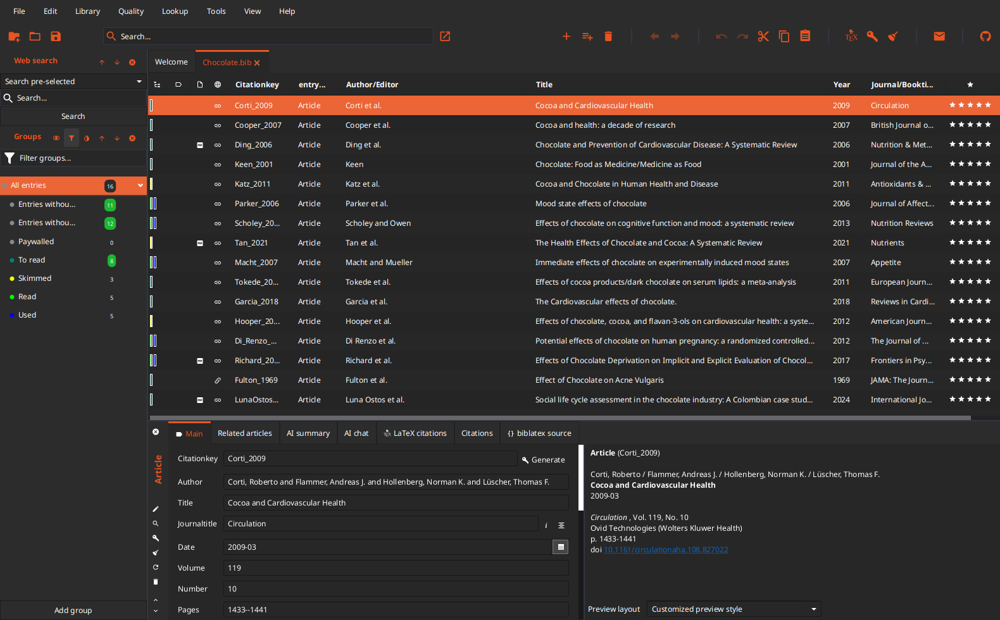
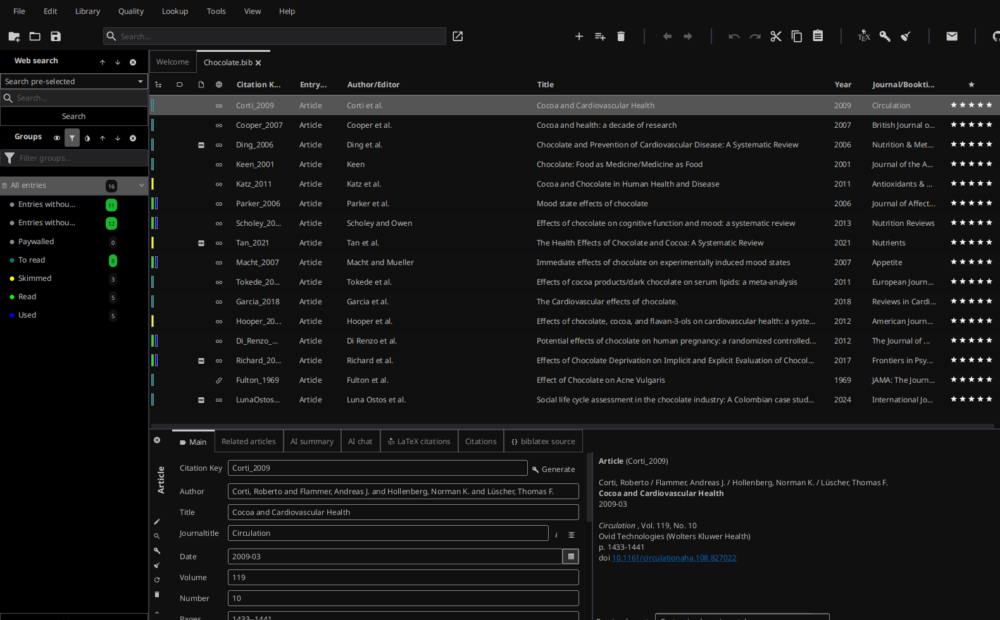
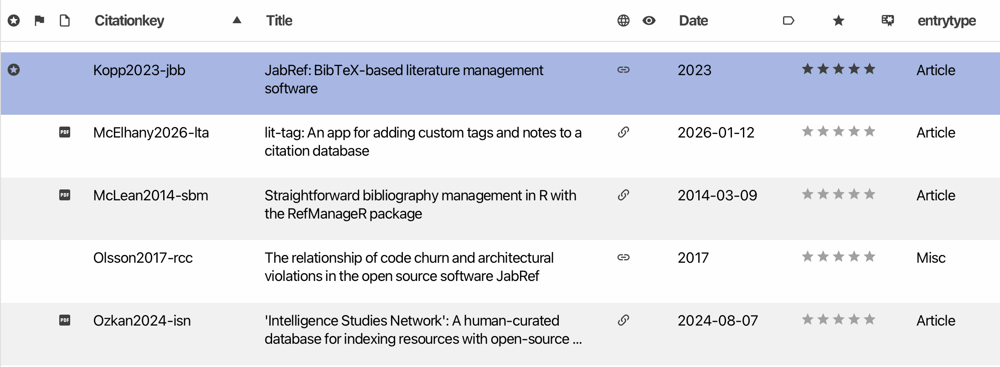

# Custom JabRef Themes

> Customize the look of JabRef using CSS!

JabRef ships two themes, _JabRef_ and _Primer_, each with a light and a dark variant. On top of the theme you can load a custom CSS file that overrides only what you want to change. This page and the [user contributed themes](https://github.com/JabRef/themes.jabref.org/tree/main/themes) target the theme model introduced with JabRef 6 ([JabRef/jabref#15798](https://github.com/JabRef/jabref/pull/15798)).

**JabRef 5.x:** the previous versions of the themes, based on the old `-jr-*` variables, are available [in the repository history](https://github.com/JabRef/themes.jabref.org/tree/0a139ff7da4ae356b293f81bd6a38659a7d7fc39/themes).

## User contributed themes

Themes submitted by users are located in the subfolder [themes](https://github.com/JabRef/themes.jabref.org/tree/main/themes). They are sorted into _Dark_ and _Light_ themes; select the matching color scheme in JabRef when using them.

## Gallery

All screenshots were taken with JabRef 6 and the theme's CSS file selected as custom theme, on the matching color scheme.

### Dark themes

| Theme | Preview |
| --- | --- |
| [DARK THEME-blackandwhite-greytext](https://github.com/JabRef/themes.jabref.org/blob/main/themes/DarkTheme/DinoGirls%20Dark%20Themes/DARK%20THEME-blackandwhite-greytext.css) (DinoGirls Dark Themes) |  |
| [DARK THEME-blackandwhite-whitetext](https://github.com/JabRef/themes.jabref.org/blob/main/themes/DarkTheme/DinoGirls%20Dark%20Themes/DARK%20THEME-blackandwhite-whitetext.css) (DinoGirls Dark Themes) |  |
| [DARK THEME-canaryyellow-greytext](https://github.com/JabRef/themes.jabref.org/blob/main/themes/DarkTheme/DinoGirls%20Dark%20Themes/DARK%20THEME-canaryyellow-greytext.css) (DinoGirls Dark Themes) |  |
| [DARK THEME-chocolatebrown-greytext](https://github.com/JabRef/themes.jabref.org/blob/main/themes/DarkTheme/DinoGirls%20Dark%20Themes/DARK%20THEME-chocolatebrown-greytext.css) (DinoGirls Dark Themes) |  |
| [DARK THEME-chocolatebrown-whitetext](https://github.com/JabRef/themes.jabref.org/blob/main/themes/DarkTheme/DinoGirls%20Dark%20Themes/DARK%20THEME-chocolatebrown-whitetext.css) (DinoGirls Dark Themes) |  |
| [DARK THEME-fuchsiapurple-greytext](https://github.com/JabRef/themes.jabref.org/blob/main/themes/DarkTheme/DinoGirls%20Dark%20Themes/DARK%20THEME-fuchsiapurple-greytext.css) (DinoGirls Dark Themes) |  |
| [DARK THEME-fuchsiapurple-whitetext](https://github.com/JabRef/themes.jabref.org/blob/main/themes/DarkTheme/DinoGirls%20Dark%20Themes/DARK%20THEME-fuchsiapurple-whitetext.css) (DinoGirls Dark Themes) |  |
| [DARK THEME-jabrefdark-greytext](https://github.com/JabRef/themes.jabref.org/blob/main/themes/DarkTheme/DinoGirls%20Dark%20Themes/DARK%20THEME-jabrefdark-greytext.css) (DinoGirls Dark Themes) |  |
| [DARK THEME-jabrefdark-whitetext](https://github.com/JabRef/themes.jabref.org/blob/main/themes/DarkTheme/DinoGirls%20Dark%20Themes/DARK%20THEME-jabrefdark-whitetext.css) (DinoGirls Dark Themes) |  |
| [DARK THEME-lightblue-greytext](https://github.com/JabRef/themes.jabref.org/blob/main/themes/DarkTheme/DinoGirls%20Dark%20Themes/DARK%20THEME-lightblue-greytext.css) (DinoGirls Dark Themes) |  |
| [DARK THEME-lightblue-whitetext](https://github.com/JabRef/themes.jabref.org/blob/main/themes/DarkTheme/DinoGirls%20Dark%20Themes/DARK%20THEME-lightblue-whitetext.css) (DinoGirls Dark Themes) |  |
| [DARK THEME-lightseagreen-greytext](https://github.com/JabRef/themes.jabref.org/blob/main/themes/DarkTheme/DinoGirls%20Dark%20Themes/DARK%20THEME-lightseagreen-greytext.css) (DinoGirls Dark Themes) |  |
| [DARK THEME-lightseagreen-whitetext](https://github.com/JabRef/themes.jabref.org/blob/main/themes/DarkTheme/DinoGirls%20Dark%20Themes/DARK%20THEME-lightseagreen-whitetext.css) (DinoGirls Dark Themes) |  |
| [DARK THEME-prehistoricamber-greytext](https://github.com/JabRef/themes.jabref.org/blob/main/themes/DarkTheme/DinoGirls%20Dark%20Themes/DARK%20THEME-prehistoricamber-greytext.css) (DinoGirls Dark Themes) |  |
| [DARK THEME-prehistoricamber-whitetext](https://github.com/JabRef/themes.jabref.org/blob/main/themes/DarkTheme/DinoGirls%20Dark%20Themes/DARK%20THEME-prehistoricamber-whitetext.css) (DinoGirls Dark Themes) |  |
| [DARK THEME-twilightlavender-greytext](https://github.com/JabRef/themes.jabref.org/blob/main/themes/DarkTheme/DinoGirls%20Dark%20Themes/DARK%20THEME-twilightlavender-greytext.css) (DinoGirls Dark Themes) |  |
| [DARK THEME-twilightlavender-whitetext](https://github.com/JabRef/themes.jabref.org/blob/main/themes/DarkTheme/DinoGirls%20Dark%20Themes/DARK%20THEME-twilightlavender-whitetext.css) (DinoGirls Dark Themes) |  |
| [DARK THEME-winered-greytext](https://github.com/JabRef/themes.jabref.org/blob/main/themes/DarkTheme/DinoGirls%20Dark%20Themes/DARK%20THEME-winered-greytext.css) (DinoGirls Dark Themes) |  |
| [DARK THEME-winered-whitetext](https://github.com/JabRef/themes.jabref.org/blob/main/themes/DarkTheme/DinoGirls%20Dark%20Themes/DARK%20THEME-winered-whitetext.css) (DinoGirls Dark Themes) |  |
| [Dracula](https://github.com/JabRef/themes.jabref.org/blob/main/themes/DarkTheme/Dracula) |  |
| [GnomeDarkOrange](https://github.com/JabRef/themes.jabref.org/blob/main/themes/DarkTheme/GnomeDarkOrange) |  |
| [JabRef-black](https://github.com/JabRef/themes.jabref.org/blob/main/themes/DarkTheme/JabRef-black) |  |

### Light themes

| Theme | Preview |
| --- | --- |
| [LIGHT THEME-darksalmon-blacktext](https://github.com/JabRef/themes.jabref.org/blob/main/themes/LightTheme/DinoGirls%20Light%20Themes/LIGHT%20THEME-darksalmon-blacktext.css) (DinoGirls Light Themes) |  |
| [LIGHT THEME-darksalmon-greytext](https://github.com/JabRef/themes.jabref.org/blob/main/themes/LightTheme/DinoGirls%20Light%20Themes/LIGHT%20THEME-darksalmon-greytext.css) (DinoGirls Light Themes) |  |
| [LIGHT THEME-iceage-blacktext](https://github.com/JabRef/themes.jabref.org/blob/main/themes/LightTheme/DinoGirls%20Light%20Themes/LIGHT%20THEME-iceage-blacktext.css) (DinoGirls Light Themes) |  |
| [LIGHT THEME-iceage-greytext](https://github.com/JabRef/themes.jabref.org/blob/main/themes/LightTheme/DinoGirls%20Light%20Themes/LIGHT%20THEME-iceage-greytext.css) (DinoGirls Light Themes) |  |
| [LIGHT THEME-icedstrawberry-blacktext](https://github.com/JabRef/themes.jabref.org/blob/main/themes/LightTheme/DinoGirls%20Light%20Themes/LIGHT%20THEME-icedstrawberry-blacktext.css) (DinoGirls Light Themes) |  |
| [LIGHT THEME-icedstrawberry-greytext](https://github.com/JabRef/themes.jabref.org/blob/main/themes/LightTheme/DinoGirls%20Light%20Themes/LIGHT%20THEME-icedstrawberry-greytext.css) (DinoGirls Light Themes) |  |
| [LIGHT THEME-jabreflight-blacktext](https://github.com/JabRef/themes.jabref.org/blob/main/themes/LightTheme/DinoGirls%20Light%20Themes/LIGHT%20THEME-jabreflight-blacktext.css) (DinoGirls Light Themes) |  |
| [LIGHT THEME-jabreflight-greytext](https://github.com/JabRef/themes.jabref.org/blob/main/themes/LightTheme/DinoGirls%20Light%20Themes/LIGHT%20THEME-jabreflight-greytext.css) (DinoGirls Light Themes) |  |
| [LIGHT THEME-japanesesakura-blacktext](https://github.com/JabRef/themes.jabref.org/blob/main/themes/LightTheme/DinoGirls%20Light%20Themes/LIGHT%20THEME-japanesesakura-blacktext.css) (DinoGirls Light Themes) |  |
| [LIGHT THEME-japanesesakura-greytext](https://github.com/JabRef/themes.jabref.org/blob/main/themes/LightTheme/DinoGirls%20Light%20Themes/LIGHT%20THEME-japanesesakura-greytext.css) (DinoGirls Light Themes) |  |
| [LIGHT THEME-limegreen-blacktext](https://github.com/JabRef/themes.jabref.org/blob/main/themes/LightTheme/DinoGirls%20Light%20Themes/LIGHT%20THEME-limegreen-blacktext.css) (DinoGirls Light Themes) |  |
| [LIGHT THEME-limegreen-greytext](https://github.com/JabRef/themes.jabref.org/blob/main/themes/LightTheme/DinoGirls%20Light%20Themes/LIGHT%20THEME-limegreen-greytext.css) (DinoGirls Light Themes) |  |
| [LIGHT THEME-neon-blacktext](https://github.com/JabRef/themes.jabref.org/blob/main/themes/LightTheme/DinoGirls%20Light%20Themes/LIGHT%20THEME-neon-blacktext.css) (DinoGirls Light Themes) |  |
| [LIGHT THEME-neon-greytext](https://github.com/JabRef/themes.jabref.org/blob/main/themes/LightTheme/DinoGirls%20Light%20Themes/LIGHT%20THEME-neon-greytext.css) (DinoGirls Light Themes) |  |
| [LIGHT THEME-peachorange-blacktext](https://github.com/JabRef/themes.jabref.org/blob/main/themes/LightTheme/DinoGirls%20Light%20Themes/LIGHT%20THEME-peachorange-blacktext.css) (DinoGirls Light Themes) |  |
| [LIGHT THEME-peachorange-greytext](https://github.com/JabRef/themes.jabref.org/blob/main/themes/LightTheme/DinoGirls%20Light%20Themes/LIGHT%20THEME-peachorange-greytext.css) (DinoGirls Light Themes) |  |
| [Interoctiv](https://github.com/JabRef/themes.jabref.org/blob/main/themes/LightTheme/Interoctiv) |  |

## Use a custom theme

1. Open `File > Preferences > General`.
2. In the _Appearance_ section, choose a _Theme_ and a _Color scheme_ (_Follow system_, _Light_, or _Dark_).
3. Tick _Custom theme_ and select your CSS file.

The custom CSS is applied on top of the selected theme and color scheme. Changes to the file are picked up while JabRef is running, so you can edit it and watch the result.

## Creating a new theme

All colors of a theme are `-color-*` variables, for example `-color-accent`, `-color-bg-primary`, `-color-fg-default`, or `-color-selection`. The complete list, with a comment on what each one is used for, is in [`jabref-theme.css`](https://github.com/JabRef/jabref/blob/main/jabgui/src/main/resources/org/jabref/gui/theme/jabref-theme.css) (and [`primer-theme.css`](https://github.com/JabRef/jabref/blob/main/jabgui/src/main/resources/org/jabref/gui/theme/primer-theme.css) for the second theme). The rest of JabRef's styling only uses these variables, so overriding them is all that is needed to re-color the whole UI.

Override a variable for both color schemes:

```css
.root {
    -color-accent: #8F0D11;
}
```

Override it for one color scheme only. The media query follows the color scheme selected in JabRef (or the operating system, with _Follow system_):

```css
@media (prefers-color-scheme: dark) {
    .root {
        -color-accent: #ff79c6;
    }
}
```

Anything else (fonts, sizes, individual controls) can be styled with regular JavaFX CSS; [`jabref-base.css`](https://github.com/JabRef/jabref/blob/main/jabgui/src/main/resources/org/jabref/gui/theme/internal/jabref-base.css) shows the style classes JabRef uses.

### Migrating a theme from JabRef 5.x

The old `-jr-*` variables no longer exist and are silently ignored. The most common ones map as follows:

| JabRef 5.x                                  | JabRef 6                                     |
| ------------------------------------------- | -------------------------------------------- |
| `-jr-theme`                                 | `-color-accent`, `-color-link`               |
| `-jr-accent`                                | `-color-accent-subtle`, `-color-selection`   |
| `-jr-hover`                                 | `-color-overlay-hover`, `-color-button-hover`|
| `-jr-base`, `-jr-menu-background`, `-jr-toolbar` | `-color-bg-tertiary`                    |
| `-jr-background-alt`                        | `-color-bg-primary`                          |
| `-jr-row-odd-background` / `-jr-row-even-background` | `-color-bg-secondary` / `-color-bg-alt` |
| `-jr-search-background`                     | `-color-bg-search`                           |
| `-jr-sidepane-background`                   | `-color-bg-sidepane`                         |
| `-jr-separator`                             | `-color-border-default`                      |
| `-fx-light-text-color` / `-fx-dark-text-color` / `-fx-mid-text-color` | `-color-fg-default`, `-color-fg-emphasis`, `-color-fg-muted` |
| `-jr-green` / `-jr-light-green`             | `-color-success` / `-color-success-emphasis` |
| `-jr-orange`                                | `-color-warning`                             |
| `-jr-light-red` / `-jr-red`                 | `-color-danger` / `-color-danger-emphasis`   |
| `-jr-scrollbar-thumb` / `-jr-scrollbar-track` | `-color-scrollbar-thumb` / `-color-scrollbar-track` |
| `-jr-tooltip-bg` / `-jr-tooltip-fg`         | `-color-tooltip-bg` / `-color-tooltip-fg`    |
| `-jr-drag-target` / `-jr-drag-target-hover` | `-color-drag-target` / `-color-drag-target-hover` |
| `-jr-group-hits-bg` / `-jr-group-hits-fg`   | `-color-badge-bg` / `-color-badge-fg`        |

Old themes were complete copies of JabRef's stylesheet. That is no longer needed: keep only the variables you change.

## Selection of Useful CSS selectors

| UI element                       | CSS selector       |
| -------------------------------- | ------------------ |
| preview box                      | `#previewBody`     |
| `{} biblatex source` tab         | `.code-area`       |
| text in `{} biblatex source` tab | `.code-area .text` |

## Known bugs

* [#8523](https://github.com/JabRef/jabref/issues/8523): On Windows 10, it is not possible to use fonts that were installed user-wide in the CSS, only system-wide fonts are working. A workaround to use fonts that are not installed system-wide is to include the font file via [`@font-face`](https://developer.mozilla.org/en-US/docs/Web/CSS/@font-face).
