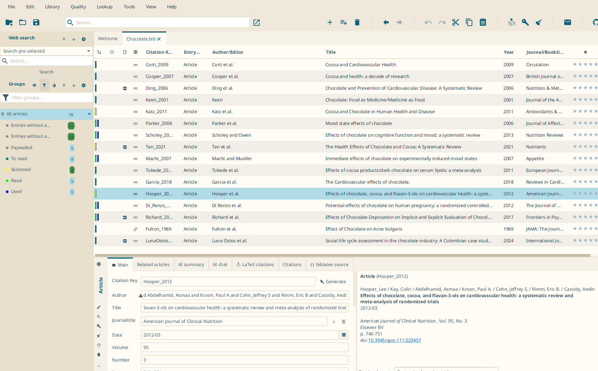

# Cala

A Balearic palette for JabRef: whitewashed sand and cove water, with pine, terracotta and a little sun. The light scheme puts deep-sea text and cove-blue accents on sand-colored paper, the dark one sand-colored text and turquoise accents on night-sea surfaces. Named after the coves the palette is taken from — Mallorca without the beach bar.

One CSS file covers both color schemes: select it as custom theme and pick _Dark_, _Light_, or _Follow system_ in `File > Preferences > General > Appearance`.

## Contrast

Every text/surface pair is checked against WCAG 2 contrast ratios, in both schemes and on every surface (window, tables, toolbar, side pane, search field, tooltips):

| Role                                      | Minimum ratio |
| ----------------------------------------- | ------------- |
| Default text                              | 7:1           |
| Muted text, accent and links as text      | 4.5:1         |
| Text on selection, badges, default button | 4.5:1         |
| Subtle text, status colors as text        | 3:1           |

Cove blue and sun yellow are too light to read as text on sand, so the light scheme uses a darkened cove blue for accent and links and keeps the sun for fills (default button, drag target). `-color-fg-emphasis` is dark in the light scheme because JabRef also draws it on the plain surface, and the group badge text is near-black in both schemes because a partially selected group gets a much paler green than `-color-success`.

Three foregrounds are set per scheme instead of through a token, because JabRef paints them with a color this theme uses as a fill: the walkthrough _Continue_ label, the label of a selected toggle button and the visited-link color.

`-color-warning` and `-color-success-emphasis` stay mid tones: they are status text and, at the same time, the fill behind default-colored text (invalid table cell, duplicate marker), and 4.5:1 on the fill cannot hold together with 3:1 as text. Both values match JabRef's own themes.
