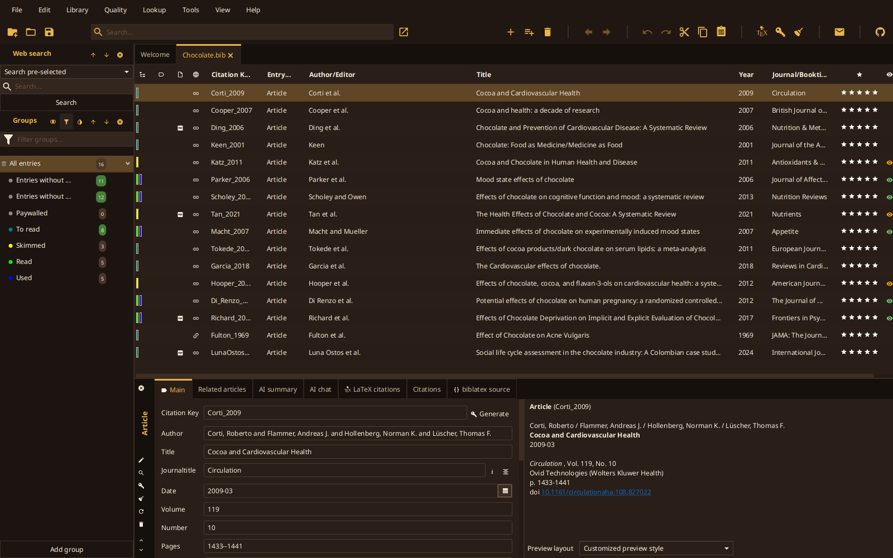
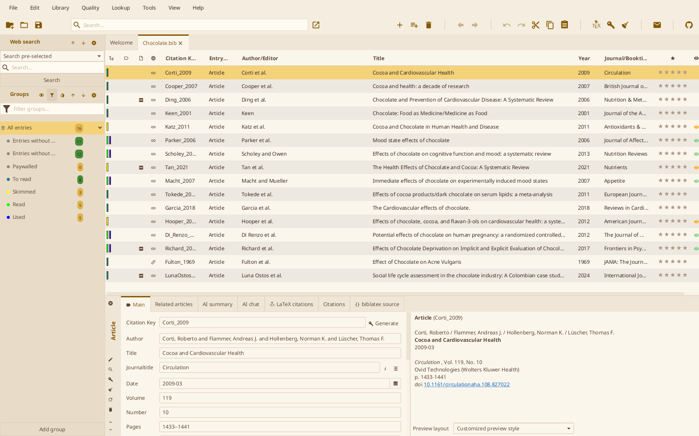

# Chocolate Honey

Cream paper with dark-chocolate text and honey accents in the light scheme, chocolate surfaces with cream text and honey accents in the dark one. One CSS file covers both color schemes: select it as custom theme and pick _Dark_, _Light_, or _Follow system_ in `File > Preferences > General > Appearance`.

## Contrast

Every text/surface pair is checked against WCAG 2 contrast ratios, in both schemes and on every surface (window, tables, toolbar, side pane, search field, tooltips):

| Role                                      | Minimum ratio |
| ----------------------------------------- | ------------- |
| Default text                              | 7:1           |
| Muted text, accent and links as text      | 4.5:1         |
| Text on selection, badges, default button | 4.5:1         |
| Subtle text, status colors as text        | 3:1           |

Honey itself is too light to read as text on cream, so the light scheme uses a darkened honey for accent and links and keeps pure honey for fills (selection, group badges, default button, focus).
