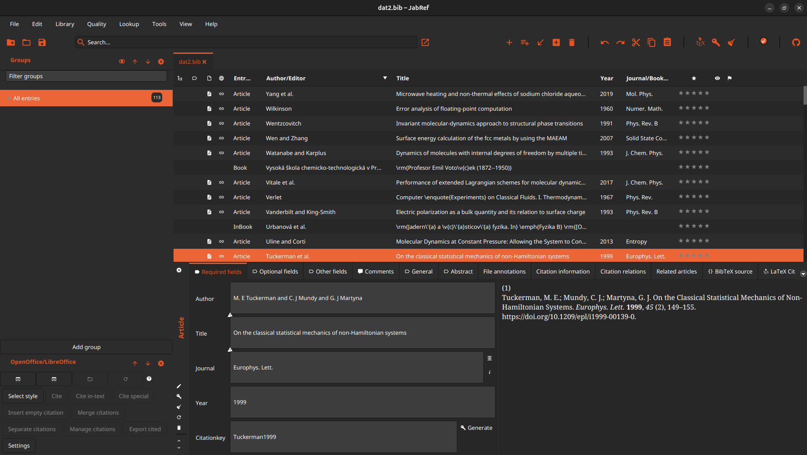

# GNOME dark theme for JabRef

Dark theme for JabRef that tries to mimic the native appearance of GNOME apps (in the latest Ubuntu).
Meanwhile, only the orange accent is implemented, but other accents can be obtained by replacing:

```
    -jr-theme: #e95420;
    -jr-accent: #eb6536;
```

with the appropriate colours in `jabref_gnome_dark_orange.css`.



This theme was inspired by other dark themes in this repository.

Author: Jiří Janek (janekj2727(at)gmail.com)

Licence: MIT
