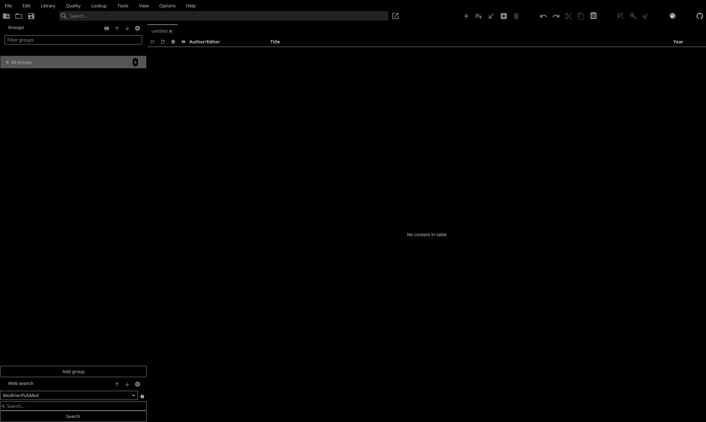

# JabRef-black

Black minimalist theme for JabRef.

Download the .css file and in JabRef click on Options → Preferences, then on the Import theme button in the lower-left corner. Now navigate to your CSS file using the opened dialog box, select your file and click open.

This theme was created by [Adam Wysokiński](https://fediscience.org/@adam_wysokinski).

This software is licensed under [The 2-Clause BSD License](LICENSE).