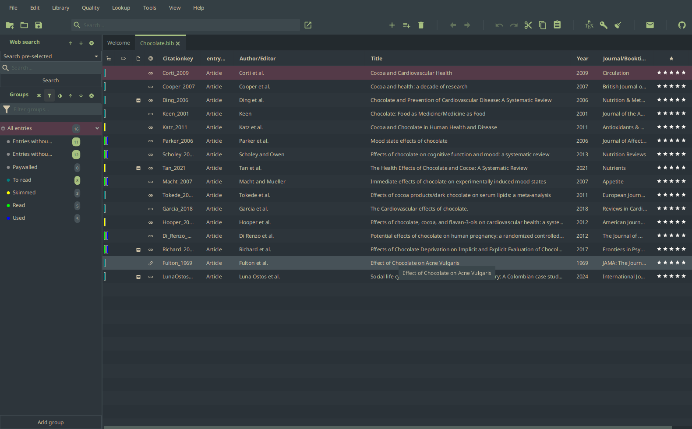
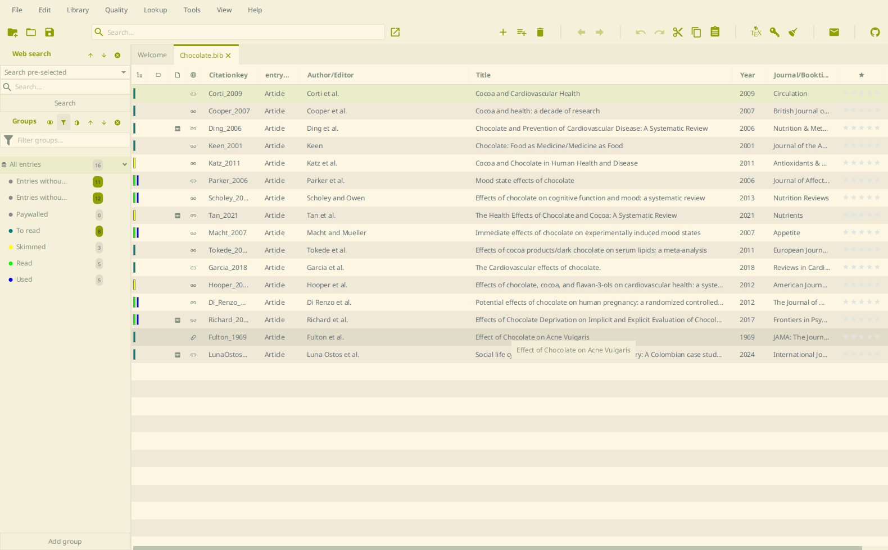

# Everforest

[Everforest](https://github.com/sainnhe/everforest) (medium contrast) for JabRef. One CSS file covers both color schemes: select it as custom theme and pick _Dark_, _Light_, or _Follow system_ in `File > Preferences > General > Appearance`.

Palette: [sainnhe/everforest](https://github.com/sainnhe/everforest), MIT license.
