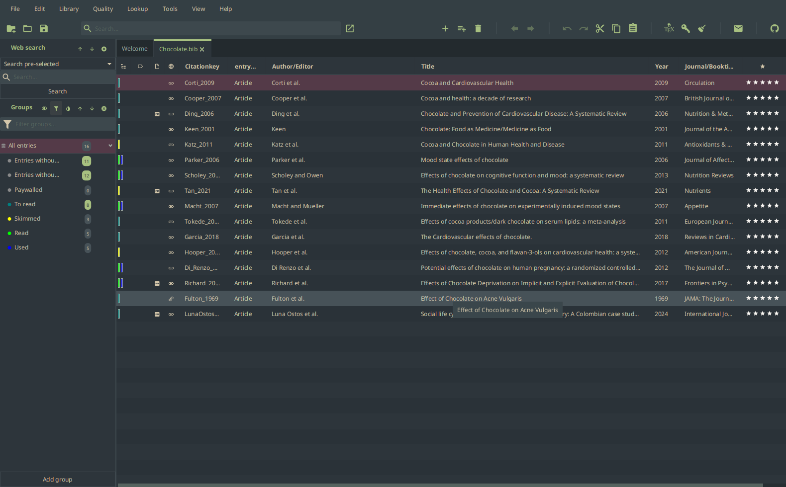
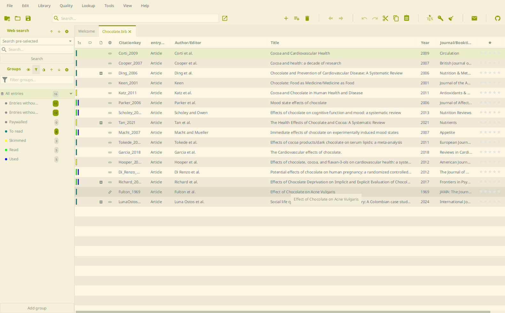

# Everforest

[Everforest Pro](https://github.com/AndreiLucaci/everforest-vscode), the maintained VS Code port of [Everforest](https://github.com/sainnhe/everforest), for JabRef. Each CSS file covers both color schemes: select it as custom theme and pick _Dark_, _Light_, or _Follow system_ in `File > Preferences > General > Appearance`.

The three variants follow the VS Code theme's:

| File                                             | VS Code variant                                            | Background |
| ------------------------------------------------ | ---------------------------------------------------------- | ---------- |
| [everforest.css](everforest.css)                 | Everforest Pro Dark / Light, balanced contrast             | medium     |
| [everforest-cozy.css](everforest-cozy.css)       | Everforest Pro Dark Cozy / Light Cozy, softer              | soft       |
| [everforest-vibrant.css](everforest-vibrant.css) | Everforest Pro Dark Vibrant / Light Vibrant, crisper       | hard       |

Palette: [AndreiLucaci/everforest-vscode](https://github.com/AndreiLucaci/everforest-vscode), MIT license, based on [sainnhe/everforest](https://github.com/sainnhe/everforest), MIT license.
