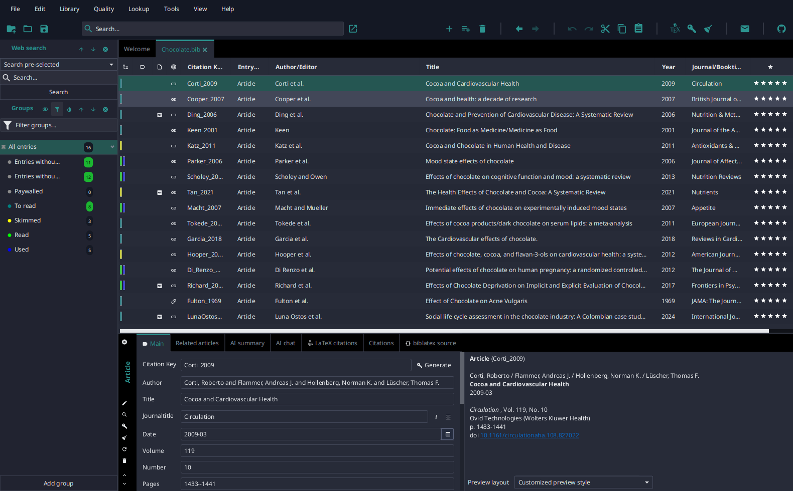
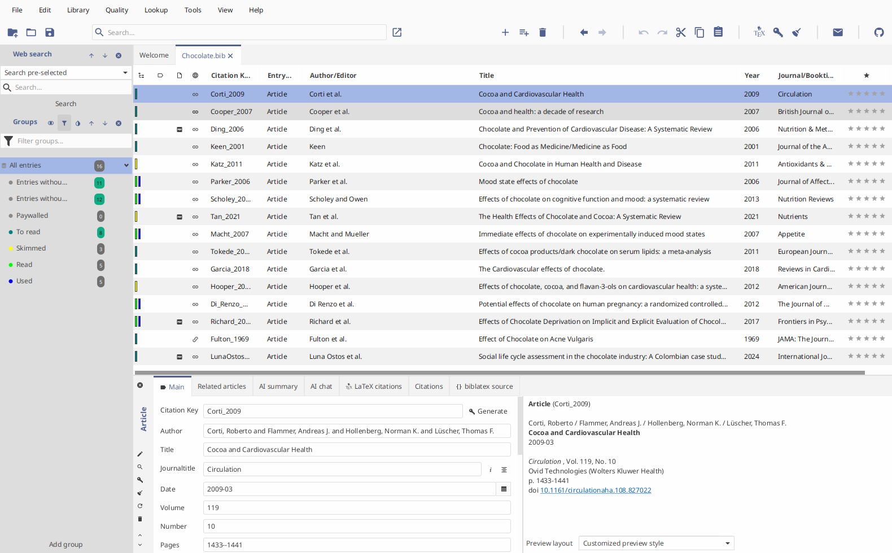

# JabRef

JabRef's default look. One CSS file covers both color schemes; JabRef bundles it from this repository and selects it when no other theme is chosen.

This file declares the complete `-color-*` token contract and styles the JavaFX controls with it. Every other theme here except Primer is layered on top of it and overrides only the tokens it changes, so a token added or removed here changes what those themes can override.

The stylesheet grew in the JabRef repository since 2018, written by many contributors; its history is the git log of `Base.css`, `Dark.css` and `jabref-theme.css` in [JabRef/jabref](https://github.com/JabRef/jabref). The commit that brought it here credits the people whose lines were still in the file at the time of the move.
