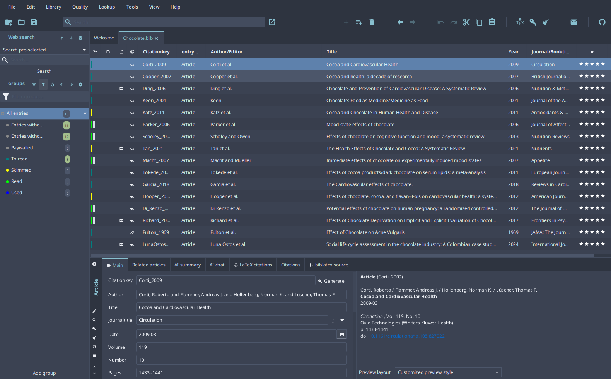
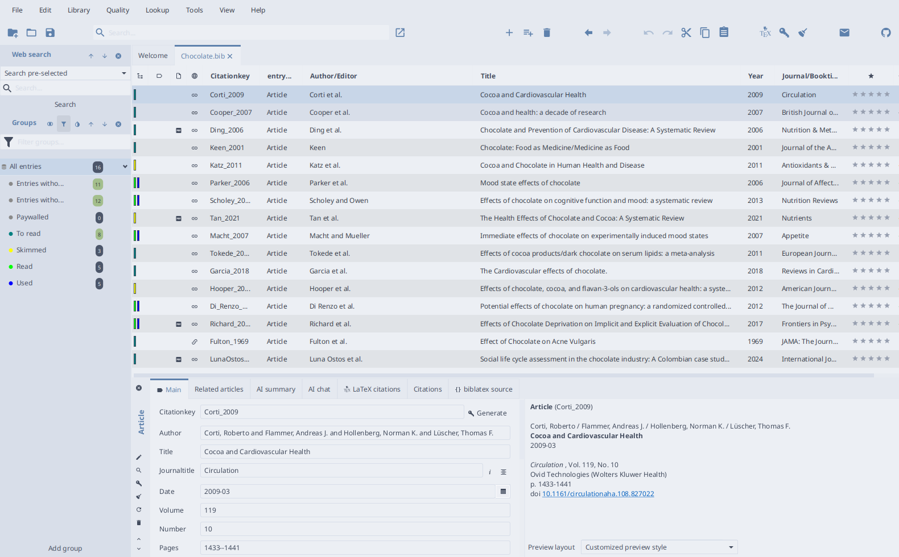

# Nord

[Nord](https://www.nordtheme.com/) for JabRef. One CSS file covers both color schemes: select it as custom theme and pick _Dark_, _Light_, or _Follow system_ in `File > Preferences > General > Appearance`.

Palette: [nordtheme.com](https://www.nordtheme.com/docs/colors-and-palettes), MIT license.
