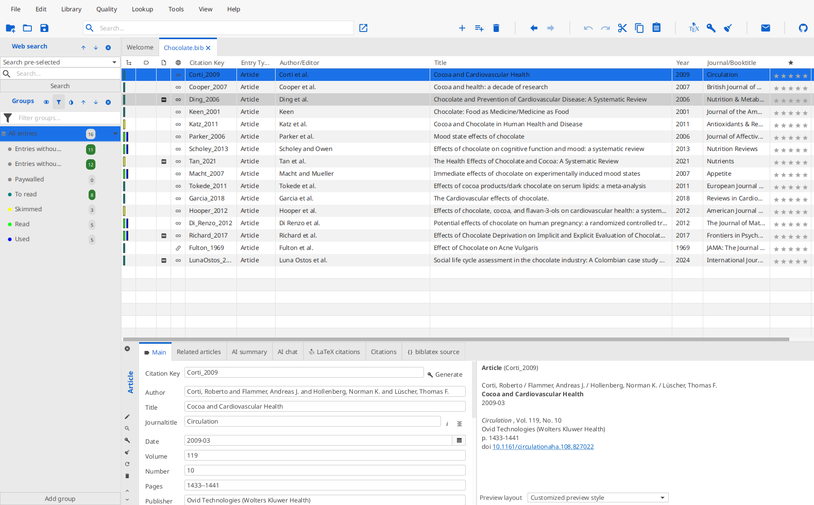
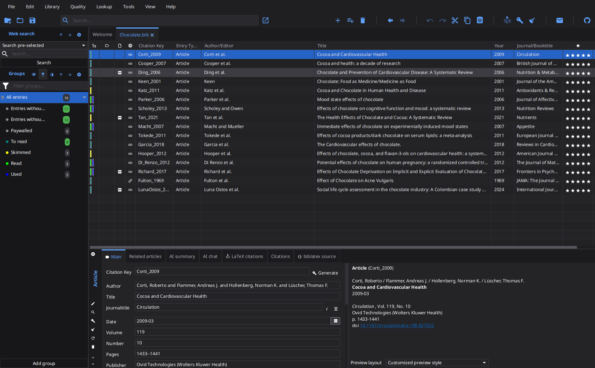

# Papers

A dense, low-chrome look inspired by the [Papers](https://www.papersapp.com/) reference manager: neutral grey chrome, a white spreadsheet-like entry table with hairline column rules, and a saturated blue selection. Besides the colors it also shrinks the paddings JabRef spends on breathing room, so noticeably more entries and fields fit on screen. The font size is untouched — change it in `File > Preferences > General > Appearance` if you want smaller text as well.

One CSS file covers both color schemes: select it as custom theme and pick _Dark_, _Light_, or _Follow system_ in `File > Preferences > General > Appearance`.

