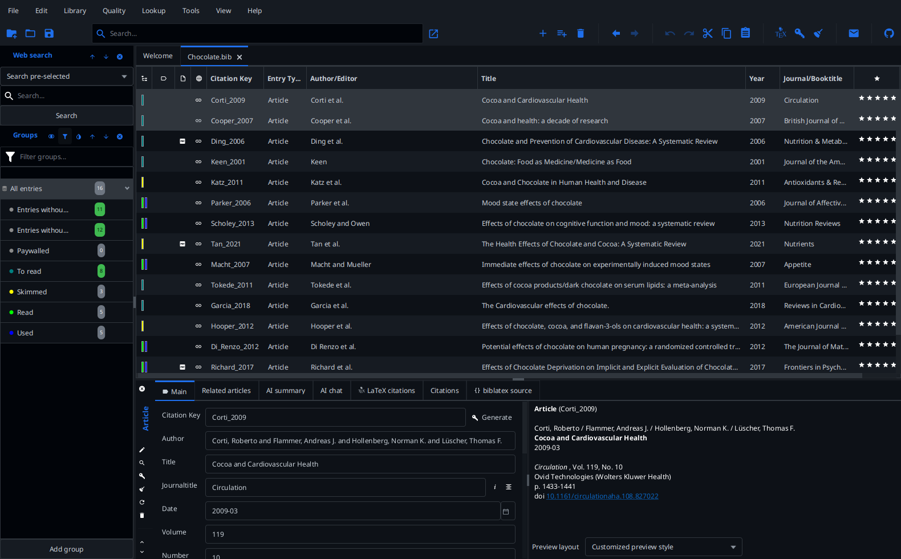
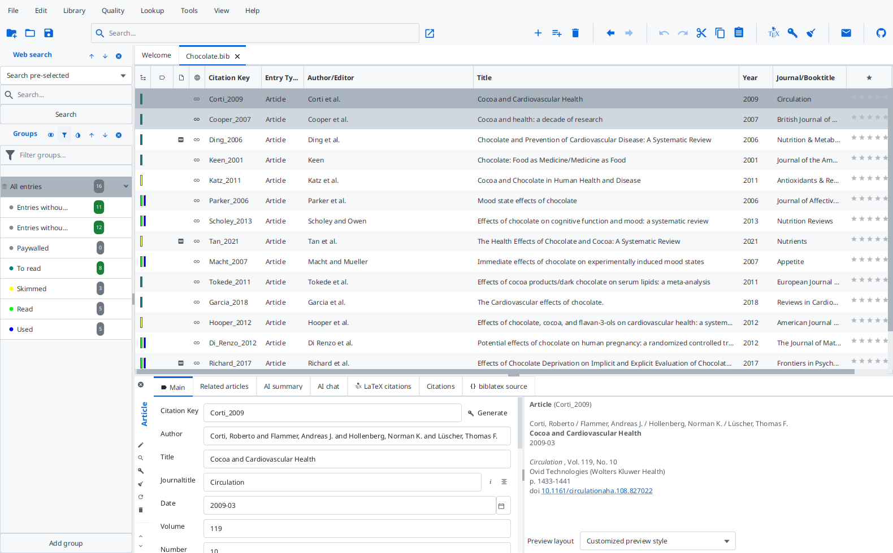

# Primer

JabRef's second built-in look, based on [AtlantaFX](https://mkpaz.github.io/atlantafx/)'s Primer theme, which in turn follows GitHub's [Primer](https://primer.style/) design system. One CSS file covers both color schemes: select it as custom theme and pick _Dark_, _Light_, or _Follow system_ in `File > Preferences > General > Appearance`.

Unlike the other themes here it does not only assign JabRef's `-color-*` tokens: it brings AtlantaFX's own token vocabulary and styles the JavaFX controls with it. Take it as the starting point for a theme that wants to change control shapes rather than only colors.

Palette and control styles: [AtlantaFX](https://github.com/mkpaz/atlantafx), MIT license.
