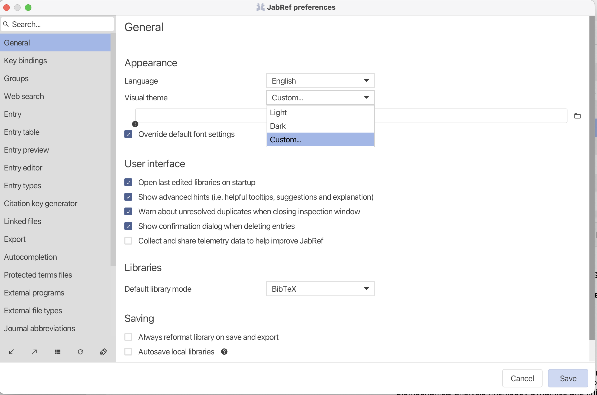

## Custom themes for JabRef

This directory contains various themes contributed by users and distinguishes between light and dark themes.

Keep in mind that user contributed themes might be distributed under different Open Source licences if you want to modify them.

## Import CSS file

### Jabref version >= 5.10

To import a CSS file to JabRef click File -> Preferences
In the General tab select _Custom_ and select the CSS file.

Keep in mind that the changes will not take effect until you have restarted JabRef.

### JabRef version < 5.10

To import a CSS file to JabRef click on Options -> Preferences (in newer JabRef versions File -> Preferences), then on the _Import theme_ button in the lower-left corner. Now navigate to your CSS file using the opened dialog box, select your file and click _open_.

After the dialog box has closed, go to the _Appearance_ tab (use the search box if you can't find it) in preferences and under _Visual theme_ chose the _Custom theme_ option. Then click _Save_ in the lower-right corner and restart the JabRef.

Keep in mind that the changes will not take effect until you have restarted JabRef.

